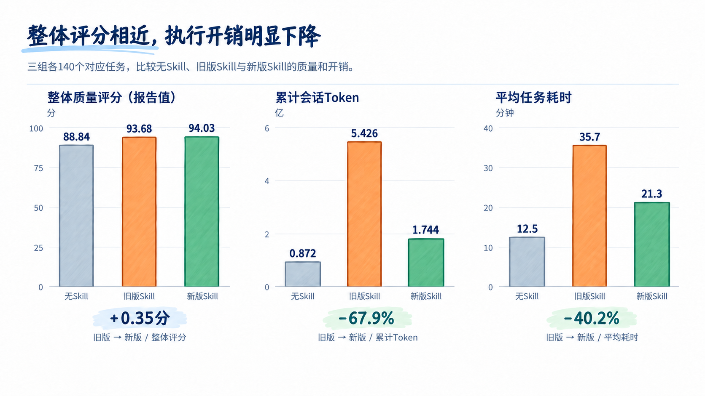

随着Fable 5、5.1和GPT-6 Astra相继发布，Skill的维护开始面临一个变化：模型能够自行完成的工作越来越多，以前为旧模型补齐能力的流程说明，需要重新检查。**当模型已经能判断下一步怎么做，Skill里仍然写死的逐步流程，就可能从经验积累变成每次执行都要支付的成本。**

官方的提示指南已经明确提出了这个问题。Anthropic在[Fable 5提示指南](https://platform.claude.com/docs/en/build-with-claude/prompt-engineering/prompting-claude-fable-5#recommended-scaffolding-changes)中指出，为旧模型开发的Skill往往规定得过细，可能降低输出质量；如果模型默认表现更好，就应考虑移除旧指令。OpenAI在[GPT-6 Astra使用指南](https://developers.openai.com/api/docs/guides/latest-model#instruction-following)中也建议审查Skill和AGENTS.md：Astra对这些文件里的指令更敏感，模糊或冲突的要求可能让它提前停下来，阻断本来可以继续完成的工作。

这背后有两种变化：模型更能自行组织工作，也更认真地执行外部约束。过去为了防止遗漏而写下的全量预读、逐步汇报和固定验证轮次，即使在当前任务中没有必要，也可能被完整执行。例如，一次局部修改本来只需读取相关文件、运行受影响的测试，旧规则却可能要求它重新梳理整个项目、更新中间报告，再跑一遍全量测试。流程照常完成，额外的质量收益却需要重新证明。

因此，模型升级后，Skill需要持续判断哪些指导已经多余，哪些项目事实、工具和交付约束仍然必要。删掉一条规则，结果会不会变差？保留一个步骤，减少的失败和返工能否抵得上它的执行成本？只有把这些问题放回实际任务中验证，Skill才能随着模型和环境变化持续演进。

*图1：模型学会更多工作后，旧流程仍会产生开销。通过任务结果判断哪些步骤可以精简，哪些支持仍需保留。*

围绕规则的增量价值，我们选择了单元测试Skill——[optimizing-java-unit-tests](https://agent.huawei.com/ai/skills/optimizing-java-unit-tests?version=0.0.1&publisherId=2018530071504031746)，在GLM-5.2上进行评测与自优化。实验以Skill优化前后的对比为主，同时设置无Skill组，观察模型不加载额外Skill指导时的表现。三组各覆盖相同的140个任务。优化后Skill减少重复说明和中间报告，将固定操作整合为脚本，并补充交付前的检查要求。相对优化前Skill，累计Token下降67.9%，平均任务耗时下降40.2%，整体质量评分从93.68变为94.03。这组结果支持在当前模型下精简部分旧流程；模型升级前后的收益变化，还需要跨版本对照来检验。

## 实验背景与研究问题

optimizing-java-unit-tests最初针对GLM-4.7-AWQ适配，用于给存量代码补齐单元测试（UT），目标是提升开发者测试生成效率，完善DT有效性分析与修复能力。为此，Skill将测试生成、有效性分析、修复和验证组织为既定流程。本次实验在GLM-5.2上重新评估这套流程，根据运行反馈优化Skill，并通过无Skill、优化前Skill和优化后Skill三组对照，比较质量与执行成本。

新版删减了部分通用流程说明和中间报告，把源码与环境信息获取、编译运行等固定操作整合为脚本，再根据运行失败补充交付约束。人工与模型一起分析运行中暴露的问题，修改Skill，再比较新旧版本的质量和开销，保留有效改动。Skill通过这样的反复迭代，逐步减少重复工作、补齐必要要求，形成适合当前模型的工作方法。

三组实验使用相同的模型和任务集，比较不同Skill配置下的质量与执行成本。

| 项目 | 设置 |
| --- | --- |
| 被测模型 | GLM-5.2 |
| 执行平台 | 九问iCode |
| 被测Skill | [optimizing-java-unit-tests](https://agent.huawei.com/ai/skills/optimizing-java-unit-tests?version=0.0.1&publisherId=2018530071504031746)，用于存量代码UT补齐任务 |
| 对照分组 | 无Skill（模型基线）、优化前Skill（旧版）、优化后Skill（新版） |
| 任务集 | 每组覆盖相同的7个项目、140个对应任务 |
| 质量评估 | 使用CodeBench评估测试质量 |
| 成本指标 | 累计会话Token、平均任务耗时 |

各组的具体配置如下：

- **无Skill（模型基线）**：不加载额外Skill指导，由模型自行组织分析、生成和验证，用于观察模型在当前执行平台与任务集上的自主完成能力。
- **优化前Skill（旧版）**：加载本轮优化前的Skill，按既定流程完成测试生成、有效性分析、修复和重新验证，作为评估优化效果的参照。
- **优化后Skill（新版）**：加载经过本轮调整的Skill，精简重复说明和中间报告，将固定操作整合为脚本，并补充交付检查要求。

通过比较三组结果，可以观察Skill带来的质量收益和执行成本，以及流程调整后的变化。在此基础上，再讨论如何把这次优化中的做法用于Skill的持续迭代。实验围绕以下三个问题展开：

- RQ1：优化前Skill相比模型基线，带来了哪些收益与开销？
- RQ2：Skill优化前后，质量与成本发生了什么变化？
- RQ3：如何构建可复用于其他Skill的自进化流程？

## RQ1：优化前Skill相比模型基线，带来了哪些收益与开销？

> RA1：使用优化前Skill时，整体报告评分比无Skill基线高4.84分，平均Token约为基线的6.2倍，耗时约为2.9倍。不同任务组从原有流程中获得的收益并不一致，因此需要结合任务表现，决定哪些步骤应当保留、哪些可以精简。

### 优化前Skill提高了整体评分，也增加了执行开销

| 条件 | 整体质量评分（报告值） | 平均每任务Token | 平均任务耗时 |
| --- | ---: | ---: | ---: |
| 无Skill（模型基线） | 88.84 | 62.3万 | 12.5分钟 |
| 优化前Skill | 93.68 | 387.6万 | 35.7分钟 |

使用优化前Skill时，整体评分比无Skill基线高4.84分，平均每任务多消耗约325.3万Token、多用约23.2分钟。原有Skill带来了质量收益，同时也增加了完成任务所需的开销。

这部分额外开销带来的质量收益，在不同任务组中有明显差别。把Apollo和MyBatis-3两组任务单独拿出来看：

| 任务组 | 无Skill评分（报告值） | 优化前Skill评分（报告值） | 无Skill平均Token | 优化前Skill平均Token |
| --- | ---: | ---: | ---: | ---: |
| Apollo | 96.94 | 96.70 | 74.7万 | 380.7万 |
| MyBatis-3 | 89.73 | 95.29 | 61.1万 | 354.0万 |

Apollo组中，模型在无Skill条件下已经取得较高评分，使用优化前Skill后，Token消耗约为基线的5.1倍，没有观察到评分增加。MyBatis-3组中，使用优化前Skill时的评分则比基线高5.56分。同一套流程在不同任务组里带来了不同的收益，Skill可以据此调整支持的范围与深度，把额外投入用在更需要帮助的任务上。

同一条规则是否有用，要看模型已经会什么，以及当前任务还需要哪些帮助。例如，模型已经熟悉项目的代码组织方式，就可以少读一些相关说明；遇到陌生的依赖关系时，明确的项目约定则能帮助它减少试错。模型能力、任务要求或工具发生变化后，原来需要反复提醒的步骤，也可能有了精简的空间。

### 每条规则都在用执行成本购买某种收益

规则带来的收益，可能是提高产物质量，也可能是减少失败、返工或人工复核。它的成本包括额外推理、工具往返，以及维护规则与脚本的投入。判断某一步是否值得保留，需要把它减少的损失与增加的成本放在同一任务语境下比较。

例如，同样是写报告，如果只是重述当前上下文里的结论，就可以考虑省去；如果下一阶段在独立会话中执行，报告就承担了信息交接的作用。读取文件也是如此：内容没有变化时可以复用，文件修改或上下文丢失后则可能需要重新读取。删减步骤前，要先看清它在什么情况下有用，省去后会影响什么。

增加规则时，也需要判断它在什么情况下有用。一次失败可能来自暂时的环境故障，也可能只发生在某类任务中。如果每次失败后都加一条要求所有任务执行的规则，Skill就会越来越繁琐。因此，遇到失败后应先找出原因：环境问题优先修复环境，只影响某类任务的问题则增加相应的处理条件，让额外步骤在需要时才执行。

确定哪些步骤可以精简、哪些要求需要补充后，就需要修改Skill，并检查实际执行效果。

## RQ2：Skill优化前后，质量与成本发生了什么变化？

> RA2：这轮优化从运行中的重复工作入手，精简说明和报告，把固定操作整合为脚本，并根据失败反馈补齐交付检查。完成调整后，新版相对旧版的累计会话Token下降67.9%，平均耗时下降40.2%，整体评分从93.68变为94.03，在更低的执行开销下取得了接近的整体评分。

### 从执行记录中定位重复工作

旧版已经把生成、分析、修复和验证串成完整流程。投入运行后，人工与模型结合执行记录和运行结果，发现了几类可以调整的工作：同一份源码被重复读取，中间报告需要反复写入和维护，部分固定验证轮次没有带来有效变化。优化从这些具体问题入手，逐步修改流程说明、配套脚本和交付要求，再通过评测检查改版效果。

### 精简重复说明和中间报告

针对反复加载流程说明、维护中间产物的负担，新版删减了部分通用流程说明和中间报告，减少固定的分析轮次，让模型按任务需要组织分析、修复和验证。

这些修改针对的是会沿着会话累积的成本。Skill说明进入会话后，还可能被后续调用反复带入；一份报告写完后，也可能由下一阶段读取，并作为历史上下文保留。省去重复说明和报告，既减少当轮的生成和读写操作，也减少后续多轮调用中的重复输入。

### 用脚本复用固定操作，减少模型的重复工作

删减文字说明后，获取项目资料、组织编译和测试命令的工作仍然存在。以运行测试为例，模型原来需要先确认项目怎样构建、目标测试怎样启动，再组织命令执行。新版把这类操作写进脚本，模型调用验证脚本即可执行编译和测试；读取源码、测试代码和构建信息，也由配套脚本集中完成。

这样，同一套执行方法写成脚本后，就能在后续任务中反复使用，减少模型每次查找信息、组织命令所需的推理和工具调用。模型仍需判断应该补哪些测试、失败是什么原因、代码该怎样修改，脚本则负责执行其中做法相对固定的操作。

为了让模型能继续分析和修复问题，脚本需要返回足够清楚的执行结果。除了报告目标测试是否实际执行，还应说明检查范围，并在失败时返回出错阶段和相关错误信息。如果只给出笼统的成功或失败标志，模型就难以判断下一步应该修改代码、调整测试，还是处理运行环境问题。

### 根据运行失败补齐交付检查

流程精简后，部分任务出现了编译失败或平台运行异常。新版据此补充了交付前的检查要求：确认代码通过编译，目标测试实际运行，并检查测试结果。

这一步为流程精简补上了明确的交付要求：编译和运行用于确认代码与测试能否正常执行，测试内容评估则关注覆盖是否充分、断言是否有效。模型可以自行安排完成任务的过程，但是否完成任务，仍要由这些检查结果来确认。

### 在同组任务上检查改版效果

完成上述调整后，新旧Skill在相同的GLM-5.2模型和140个任务上接受对照评测，由CodeBench评估测试质量，同时统计Token消耗和耗时。过程报告先呈现了执行方式的变化：

| 过程指标（既有过程报告汇总） | 优化前Skill | 优化后Skill |
| --- | ---: | ---: |
| 顶层工具调用次数 | 9,736 | 5,326 |
| 中间产物写入或修改次数 | 2,416 | 60 |
| Skill入口加载次数 | 362 | 419 |
| 每次入口加载的平均返回字符 | 22.7K | 4.9K |

中间产物写入或修改次数明显减少，顶层工具调用也随之下降。新版加载Skill的次数从362次增加到419次，但每次返回的内容平均从22.7K字符缩短到4.9K字符。加载次数增加，并没有抵消单次加载内容精简带来的开销改善。

原始记录中，旧版到新版减少的Token约98.3%来自输入侧。这些输入包括Skill说明、源码、工具结果和历史对话，与减少重复说明、报告及工具交互的调整方向一致。整体质量与成本的对照结果如下：

| 指标 | 优化前Skill | 优化后Skill | 变化 |
| --- | ---: | ---: | ---: |
| 整体质量评分（报告值） | 93.68 | 94.03 | +0.35分 |
| 累计会话Token | 5.426亿 | 1.744亿 | −67.9% |
| 平均任务耗时 | 35.7分钟 | 21.3分钟 | −40.2% |

新版平均每任务约124.5万Token，仍为无Skill组的2倍，但已明显低于旧版的387.6万Token。几类修改共同构成了这次新版Skill，上述数据反映的是整轮调整的效果，尚不能据此分配每项改动各自带来的收益。

*图2：无Skill为模型基线，旧版Skill与新版Skill分别对应优化前和优化后。三组使用相同的140个任务，质量由CodeBench评分，Token统计所有任务各轮调用的输入与输出总量，耗时按140个任务的执行时间取平均值。*

回看这轮优化，从旧Skill建立到新版接受评测，可以归纳为能力构建、问题发现、流程精简、脚本整合、稳定性补强和评测迭代六个阶段。先让流程能够完成任务，再根据执行记录减少重复工作、整合固定操作，并针对运行失败补齐交付检查，最后用新旧版本对照检验这些调整的效果。

*图3：本轮优化的六个阶段，串起问题发现、具体修改与效果验证。*

## RQ3：如何构建可复用于其他Skill的自进化流程？

> RA3：其他Skill可以在模型升级后，沿用原有交付标准，重新比较无Skill与现行Skill的表现，再结合运行记录调整规则和脚本。模型辅助检查哪些步骤已经可以自行完成、哪些指导仍有必要，人工审核修改，并通过新旧Skill的评测决定是否采用。随着模型能力继续提升，重复这一过程，让Skill逐步调整指导的范围和执行方式。

随着模型能力提升，原来需要Skill逐步指导的分析和验证工作，模型可能已经能够主动完成。其他Skill也可以在模型升级后，用同一组任务重新比较无Skill与现行Skill的表现，结合运行记录检查哪些步骤可以精简、哪些要求仍需保留，再修改Skill并比较调整后的质量与开销。

### 让模型修改方法，让评测决定修改是否成立

模型可以同时阅读Skill、任务要求、运行轨迹和失败结果，提出哪些规则应删减、哪些操作适合脚本化、哪些约束存在缺口。这种参与方式把模型的分析能力用到了工作方法本身。

但执行方法与成功标准需要分开维护。如果候选Skill可以同时删掉测试要求、缩小测试范围，再用新的标准证明自己更快，就无法判断改进来自能力增强还是要求降低。人工应预先确定验收条件，候选版本在相同标准下接受检查。

本次实验以7个项目、140个任务作为共同数据集。分析这些任务的执行记录，可以发现重复读取、报告维护和验证遗漏等具体问题，为调整Skill提供依据。修改后，再让新旧Skill完成同组任务，由CodeBench评估测试质量，并结合编译、运行结果及Token和耗时，检查调整是否减少了开销、是否影响了交付质量。评测的数据集在这个过程中起着非常关键的作用，让Skill的持续优化建立在可复查的任务表现上。

### 先明确修改原因，再检查改版效果

每次修改都应对应运行中发现的具体问题。例如，如果升级后的模型已经能够主动完成某项分析，旧Skill却仍要求按固定轮次重复执行，就可以尝试减少这部分步骤。修改时写清楚删了什么、为什么删，以及哪些交付检查仍需保留，便于后续检查效果。

修改完成后，在升级后的模型上，让新旧Skill分别执行同一组任务，并沿用原有的交付标准。先检查任务完成情况和产物质量，再比较Token消耗与耗时。如果省去了重复工作，任务结果仍然符合要求，就可以保留改动；如果删减后出现遗漏或错误，就需要调整相关步骤，或恢复原来的做法。

后续还可以留出未参与优化的任务，检查改动能否适用于其他同类场景，避免只改善已经反复分析过的样例。

### 把有效改动写回Skill

评测确认改动有效后，就把新的规则写回Skill，并同步更新配套脚本，让后续任务按调整后的方式执行。例如，已经验证可以省去的分析报告，就从默认流程中删除；需要保留的验证步骤，则继续写在交付要求中。更新时保留旧版，并记录使用的模型、数据集版本、修改原因和评测结果，方便后续复查或回退。

*图4：模型升级后的Skill更新流程。先比较无Skill与当前Skill，检查原有指导是否仍有必要；修改后再比较旧版与候选版，按原有交付要求验证效果，将有效改动写回Skill。*

模型再次升级后，可以从版本记录中找出为弥补旧模型不足而加入的规则，再用实际任务检查新模型是否仍然需要这些指导。如果省去某些步骤后仍能达到交付要求，就把精简后的流程写回Skill。这样，后续任务就能少做已经不再需要的重复工作。

## 结语：让skill进化跟上模型的进步

这次单元测试优化通过精简流程、整合脚本和补充交付检查，在整体评分相近的情况下，让累计Token下降67.9%、平均耗时下降40.2%。这些结果让我们看到，围绕模型建立的工作流程，本身也有持续优化的空间。

一条规则记录的，既有工程师的经验，也有模型当时的能力局限。模型学会某项工作后，重复指导的收益会降低，但规则要求的报告、读取和工具调用仍会继续发生。过去帮助模型完成任务的步骤，就可能成为今天的额外负担。模型升级后，已有流程也需要重新证明自己的价值。省去这些多余步骤，模型就能少做重复工作，减少完成任务所需的时间和Token。

随着模型能够自行组织更多工作，Skill可以逐步减少对分析顺序和固定轮次的规定，把任务要求、工具接口和交付检查写得更清楚。有了明确的交付要求和可靠的评测，就可以让模型更灵活地选择做法。流程可以随着模型进步而调整，交付质量仍由同一套标准衡量。

这次实践中，运行记录和评测结果被用于修改Skill，经过验证的改动再写回流程，供后续任务使用。持续进化还需要把真实任务、失败案例和验收要求沉淀为可复用的数据集，让每次修改都有具体的问题来源和验证依据。随着模型进步，过去需要逐步指导的工作可以更多地交给模型，工程师则把精力放在明确要求、维护数据集、完善工具和验证结果上。Skill自进化最终要沉淀的，是持续检验和更新工程经验的能力，让积累下来的方法跟得上模型的进步。
