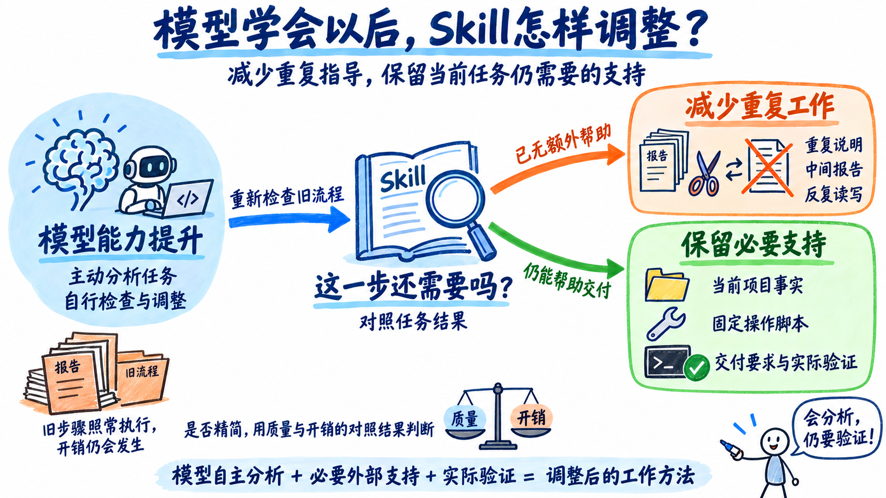
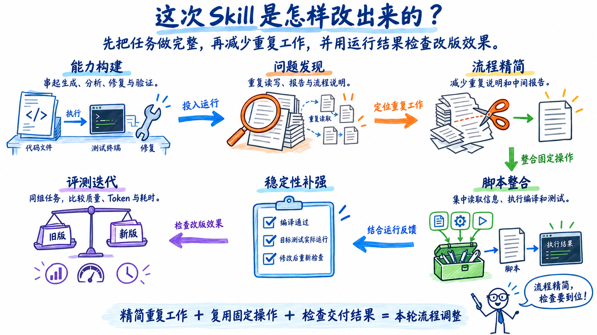
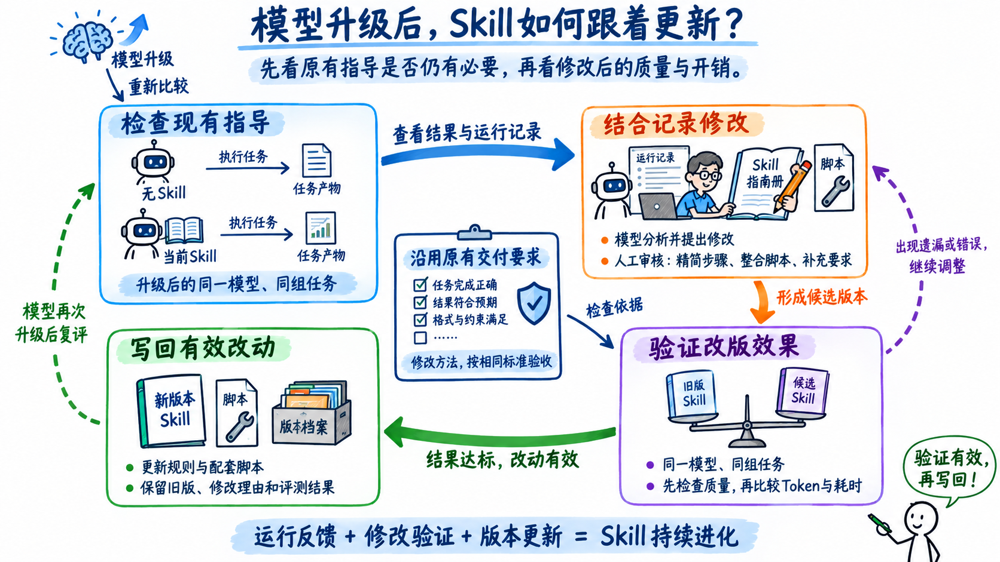

一套Skill往往记录着模型曾经做不好的事：容易漏掉需求，就加检查清单；多轮修改容易丢失结论，就写中间报告；不会稳定地验证结果，就规定分析与运行的顺序。这些规则把工程经验变成可复用的工作方法，也把当时的能力局限固化进了流程。

模型能力变化以后，规则的收益和成本可能朝两个方向走。如果模型已经能主动完成相应分析，重复提醒的收益就会降低；规则要求的报告、读取和工具往返却仍然发生。**Skill需要持续回答：在当前模型、任务和环境下，多加这一步，究竟改善了什么结果？**

这意味着，维护Skill要同时设计规则的加入条件和退出条件。随着后训练等能力改进，部分通用方法可能逐渐由模型承担；项目当前的事实、组织的交付要求和本次运行的结果，仍需要外部提供或实际获取。职责如何移动，应由运行证据决定。

这次单元测试实验给出了一个具体切口：调整流程后，记录中的累计Token下降67.9%，平均任务耗时下降40.2%，整体质量评分从93.68变为94.03。这个结果说明，旧流程还有精简空间：减少重复的分析和报告，保留有助于完成任务的指导与验证。

*图1：模型学会更多工作后，旧流程仍会产生开销。通过任务结果判断哪些步骤可以精简，哪些支持仍需保留。*

## 实验背景与研究问题

实验围绕单元测试展开。生成、有效性分析和迭代优化三个Skill协同工作，并通过编译运行检查结果。旧版的重点是让模型按完整流程完成一次单测任务：生成测试后，检查测试是否有效，根据编译和运行结果修复问题，再重新验证。实际使用中，又暴露出重复读取源码、中间报告反复维护、部分验证轮次没有带来有效变化等过程负担。

新版删减了部分通用流程说明和中间报告，把源码与环境信息获取、编译运行等固定操作整合为脚本，再根据运行失败补充交付约束。人工与模型一起分析运行中暴露的问题，修改Skill，再比较新旧版本的质量和开销，保留有效改动。Skill通过这样的反复迭代，逐步减少重复工作、补齐必要要求，形成适合当前任务的工作方法。

实验设置无Skill、完整Skill（旧版）和优化Skill（新版）三组，各覆盖7个项目、140个对应任务。三组均在九问iCode上使用GLM-5.2模型完成任务，由CodeBench评估测试质量，同时记录任务执行过程中的Token消耗和耗时。无Skill组不加载额外的Skill指导，由模型自行组织分析、生成和验证工作。

通过比较三组结果，可以观察Skill带来的质量收益和执行成本，以及流程调整后的变化。在此基础上，再讨论如何把这次优化中的做法用于Skill的持续迭代。实验围绕以下三个问题展开：

- **RQ1：完整Skill相比无Skill，带来了多少增量价值？**
- **RQ2：精简流程、整合脚本并补强约束后，质量与成本发生了什么变化？**
- **RQ3：如何构建可复用于其他Skill的自进化流程？**

## RQ1：完整Skill相比无Skill，带来了多少增量价值？

> **RA1：**完整Skill的整体报告评分比无Skill高4.84分，平均Token约为基线的6.2倍，耗时约为2.9倍。不同任务组从完整流程中获得的收益并不一致，因此需要结合任务表现，决定哪些步骤应当保留、哪些可以精简。

### 完整Skill提高了整体评分，也增加了执行开销

| 条件 | 整体质量评分（报告值） | 平均每任务Token | 平均任务耗时 |
| --- | ---: | ---: | ---: |
| 无Skill | 88.84 | 62.3万 | 12.5分钟 |
| 完整Skill（旧版） | 93.68 | 387.6万 | 35.7分钟 |

完整Skill的整体评分比无Skill高4.84分，平均每任务多消耗约325.3万Token、多用约23.2分钟。完整流程带来了质量收益，同时也增加了完成任务所需的开销。

这部分额外开销带来的质量收益，在不同任务组中有明显差别。把Apollo和MyBatis-3两组任务单独拿出来看：

| 任务组 | 无Skill评分（报告值） | 旧版Skill评分（报告值） | 无Skill平均Token | 旧版Skill平均Token |
| --- | ---: | ---: | ---: | ---: |
| Apollo | 96.94 | 96.70 | 74.7万 | 380.7万 |
| MyBatis-3 | 89.73 | 95.29 | 61.1万 | 354.0万 |

Apollo组中，无Skill已经取得较高评分，完整流程把Token提高到约5.1倍，没有观察到评分增加。MyBatis-3组中，旧版则高5.56分。同一套流程在不同任务组里带来了不同的收益，Skill可以据此调整支持的范围与深度，把额外投入用在更需要帮助的任务上。

**同一条规则是否有用，要看模型已经会什么，以及当前任务还需要哪些帮助。**例如，模型已经熟悉项目的代码组织方式，就可以少读一些相关说明；遇到陌生的依赖关系时，明确的项目约定则能帮助它减少试错。模型能力、任务要求或工具发生变化后，原来需要反复提醒的步骤，也可能有了精简的空间。

### 每条规则都在用执行成本购买某种收益

规则带来的收益，可能是提高产物质量，也可能是减少失败、返工或人工复核。它的成本包括额外推理、工具往返，以及维护规则与脚本的投入。判断某一步是否值得保留，需要把它减少的损失与增加的成本放在同一任务语境下比较。

例如，同样是写报告，如果只是重述当前上下文里的结论，就可以考虑省去；如果下一阶段在独立会话中执行，报告就承担了信息交接的作用。读取文件也是如此：内容没有变化时可以复用，文件修改或上下文丢失后则可能需要重新读取。**删减步骤前，要先看清它在什么情况下有用，省去后会影响什么。**

增加规则时，也需要判断它在什么情况下有用。一次失败可能来自暂时的环境故障，也可能只发生在某类任务中。如果每次失败后都加一条要求所有任务执行的规则，Skill就会越来越繁琐。因此，遇到失败后应先找出原因：环境问题优先修复环境，只影响某类任务的问题则增加相应的处理条件，让额外步骤在需要时才执行。

确定哪些步骤可以精简、哪些要求需要补充后，就需要修改Skill，并检查实际执行效果。这轮优化减少了重复说明和中间报告，将固定操作整合为脚本，再根据运行反馈补充交付要求。随后让新旧版本分别完成同一组任务，比较调整后的测试质量、Token消耗和耗时。

## RQ2：精简流程、整合脚本并补强约束后，质量与成本发生了什么变化？

> **RA2：**新版相对旧版的累计会话Token下降67.9%，平均耗时下降40.2%，整体评分从93.68变为94.03。新版以更低的执行开销取得了接近的整体评分，开销改善覆盖了多数任务。

### 开销下降，整体评分相近

| 指标 | 完整Skill（旧版） | 优化Skill（新版） | 变化 |
| --- | ---: | ---: | ---: |
| 整体质量评分（报告值） | 93.68 | 94.03 | +0.35分 |
| 累计会话Token | 5.426亿 | 1.744亿 | −67.9% |
| 平均任务耗时 | 35.7分钟 | 21.3分钟 | −40.2% |

新版平均每任务约124.5万Token，仍为无Skill组的2倍。与旧版相比，为额外支持付出的代价已经明显降低。优化的价值体现在这里：保留有用的指导与执行能力，同时减少围绕它们发生的重复工作。

*图2：三种方案在同一组140个任务上的质量与开销对比。质量由CodeBench评分，Token统计所有任务各轮调用的输入与输出总量，耗时按140个任务的执行时间取平均值。*

### 流程成本会沿着会话累积

这轮调整经历了能力构建、问题发现、流程精简、脚本整合、稳定性补强和评测迭代六个阶段。调整的重点也随之变化：先把生成、分析、修复和验证串成完整流程，再减少运行中发现的重复工作，并根据运行反馈补充必要的交付要求。

*图3：本轮优化的六个阶段。先建立完整流程，再根据运行中发现的问题减少重复工作、整合固定操作、补充交付检查，最后比较新旧版本的质量与开销。*

| 过程指标（既有过程报告汇总） | 旧版 | 新版 |
| --- | ---: | ---: |
| 顶层工具调用次数 | 9,736 | 5,326 |
| 中间产物写入或修改次数 | 2,416 | 60 |
| Skill入口加载次数 | 362 | 419 |
| 每次入口加载的平均返回字符 | 22.7K | 4.9K |

新版加载Skill的次数从362次增加到419次，但每次返回的内容平均从22.7K字符缩短到4.9K字符。这些说明进入会话后，还可能被后续调用反复带入，因此缩短说明也能减少后续轮次的重复输入。

中间报告也会产生类似的开销。一份报告写完后，可能还要由下一阶段读取，并作为历史上下文保留在后续对话中。省去一份重复报告，既减少了生成和读写操作，也减少了它在后续多轮调用中占用的输入Token。

原始记录中，旧版到新版减少的Token约98.3%来自输入侧。这些输入包括Skill说明、源码、工具结果和历史对话。评估流程开销时，既要看每轮传入多少内容，也要看这些内容在后续调用中重复了多少次。除了精简说明和报告，新版还通过整合脚本，减少获取信息和执行验证时的反复交互。

### 用脚本复用固定操作，减少模型的重复工作

以运行测试为例，模型原来需要先确认项目怎样构建、目标测试怎样启动，再组织命令执行。新版把这类操作写进脚本，模型调用验证脚本即可执行编译和测试；读取源码、测试代码和构建信息，也由配套脚本集中完成。

这样，同一套执行方法写成脚本后，就能在后续任务中反复使用，减少模型每次查找信息、组织命令所需的推理和工具调用。模型仍需判断应该补哪些测试、失败是什么原因、代码该怎样修改，脚本则负责执行其中做法相对固定的操作。

为了让模型能继续分析和修复问题，脚本需要返回足够清楚的执行结果。模型需要知道目标测试是否实际执行、验证覆盖了什么、失败发生在哪一层。把一串操作包装成一个入口，如果只返回模糊的成功标志，就会压缩掉诊断所需的信息。因此，脚本化应减少重复组织工作，同时让结果和失败更容易检查。

### 分析步骤可以调整，交付证据必须对应当前结果

流程精简后，部分任务出现了编译失败或平台运行异常。新版据此补充了交付前的检查要求：确认代码通过编译，目标测试实际运行，并检查测试结果。验证后如果又修改了代码，还需要重新执行相关检查，以最终版本的运行结果确认任务完成。

这轮调整也让Skill需要保留什么变得更清楚。对于模型已经能够自行完成的分析，可以减少固定轮次和报告要求，让模型按任务需要选择做法。交付前的检查则要围绕测试质量展开：编译和运行用于确认代码与测试能否正常执行，测试内容评估则关注覆盖是否充分、断言是否有效。**Skill可以给模型更多选择工作方法的空间，同时明确任务完成前必须检查哪些结果。**

在明确检查内容之后，Skill还需要说明什么时候应当重新检查。例如，代码虽然没有修改，依赖版本更新后，原来通过的测试也可能失败。因此，能否沿用已有结果，要看代码、输入和运行环境是否发生了相关变化；有变化时，就需要重新执行受影响的检查。

## RQ3：如何构建可复用于其他Skill的自进化流程？

> **RA3：**其他Skill可以在模型升级后，沿用原有交付标准，重新比较无Skill与现行Skill的表现，再结合运行记录调整规则和脚本。模型辅助检查哪些步骤已经可以自行完成、哪些指导仍有必要，人工审核修改，并通过新旧Skill的评测决定是否采用。随着模型能力继续提升，重复这一过程，让Skill逐步调整指导的范围和执行方式。

随着模型能力提升，原来需要Skill逐步指导的分析和验证工作，模型可能已经能够主动完成。其他Skill也可以在模型升级后，用同一组任务重新比较无Skill与现行Skill的表现，结合运行记录检查哪些步骤可以精简、哪些要求仍需保留，再修改Skill并比较调整后的质量与开销。

### 让模型修改方法，让评测决定修改是否成立

模型可以同时阅读Skill、任务要求、运行轨迹和失败结果，提出哪些规则应删减、哪些操作适合脚本化、哪些约束存在缺口。这种参与方式把模型的分析能力用到了工作方法本身。

但执行方法与成功标准需要分开维护。如果候选Skill可以同时删掉测试要求、缩小测试范围，再用新的标准证明自己更快，就无法判断改进来自能力增强还是要求降低。人工应预先确定验收条件，候选版本在相同标准下接受检查。

模型可以根据运行反馈修改Skill，再通过独立评测检查修改后的质量和开销。评测需要覆盖任务本身的要求：单元测试既要检查编译和运行结果，也要评估测试内容是否有效；文档生成则需要检查事实和内容，必要时由人工抽检。只有评测能发现这些问题，才能判断哪些修改值得保留，让Skill在后续迭代中持续改进。

### 先明确修改原因，再检查改版效果

每次修改都应对应运行中发现的具体问题。例如，如果升级后的模型已经能够主动完成某项分析，旧Skill却仍要求按固定轮次重复执行，就可以尝试减少这部分步骤。修改时写清楚删了什么、为什么删，以及哪些交付检查仍需保留，便于后续检查效果。

修改完成后，在升级后的模型上，让新旧Skill分别执行同一组任务，并沿用原有的交付标准。先检查任务完成情况和产物质量，再比较Token消耗与耗时。如果省去了重复工作，任务结果仍然符合要求，就可以保留改动；如果删减后出现遗漏或错误，就需要调整相关步骤，或恢复原来的做法。

评测时还可以留出一部分任务，不让它们参与前面的分析和修改，等Skill改完后再执行。这能帮助检查改版是否也适用于其他同类任务。

### 把有效改动写回Skill

评测确认改动有效后，就把新的规则写回Skill，并同步更新配套脚本，让后续任务按调整后的方式执行。例如，已经验证可以省去的分析报告，就从默认流程中删除；需要保留的验证步骤，则继续写在交付要求中。更新时保留旧版，并记录使用的模型、修改原因和评测结果，方便后续复查或回退。

*图4：模型升级后的Skill更新流程。先比较无Skill与当前Skill，检查原有指导是否仍有必要；修改后再比较旧版与候选版，按原有交付要求验证效果，将有效改动写回Skill。*

模型再次升级后，可以从版本记录中找出为弥补旧模型不足而加入的规则，再用实际任务检查新模型是否仍然需要这些指导。**如果省去某些步骤后仍能达到交付要求，就把精简后的流程写回Skill。**这样，后续任务就能少做已经不再需要的重复工作。

## 结语：让skill进化跟上模型的进步

这次单元测试优化通过精简流程、整合脚本和补充交付检查，在整体评分相近的情况下，让累计Token下降67.9%、平均耗时下降40.2%。这些结果让我们看到，围绕模型建立的工作流程，本身也有持续优化的空间。

一条规则记录的，既有工程师的经验，也有模型当时的能力局限。模型学会某项工作后，重复指导的收益会降低，但规则要求的报告、读取和工具调用仍会继续发生。过去帮助模型完成任务的步骤，就可能成为今天的额外负担。**模型升级后，已有流程也需要重新证明自己的价值。**省去这些多余步骤，模型就能少做重复工作，减少完成任务所需的时间和Token。

随着模型能够自行组织更多工作，Skill可以逐步减少对分析顺序和固定轮次的规定，把任务要求、工具接口和交付检查写得更清楚。有了明确的交付要求和可靠的评测，就可以让模型更灵活地选择做法。**流程可以随着模型进步而调整，交付质量仍由同一套标准衡量。**

这次实践中，运行记录和评测结果被用于修改Skill，经过验证的改动再写回流程，供后续任务使用。随着模型进步，过去需要逐步指导的工作可以更多地交给模型，工程师则把精力放在明确要求、完善工具和验证结果上。**经验的价值，也包括帮助我们判断什么时候应该改变原来的做法。**让Skill持续接受运行反馈、更新自身流程，才能把模型一次次的能力提升，转化为实际工作中不断积累的改进。
