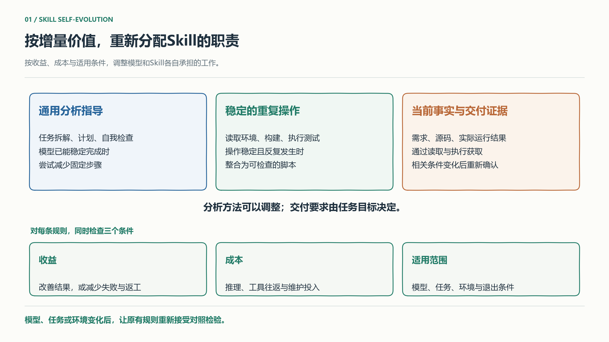
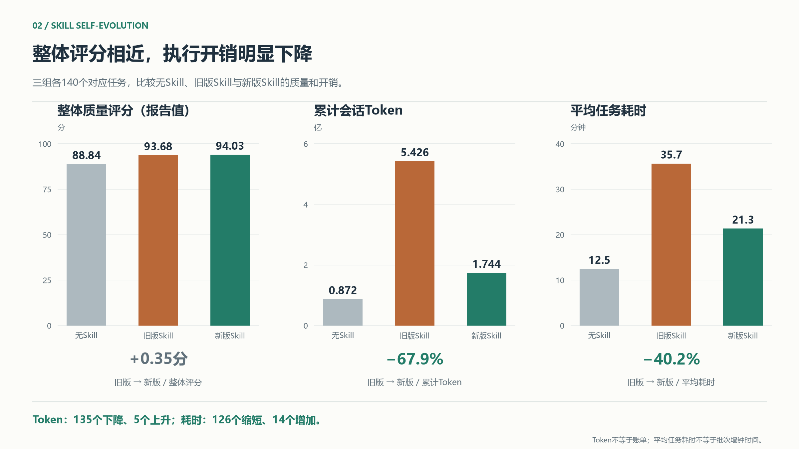
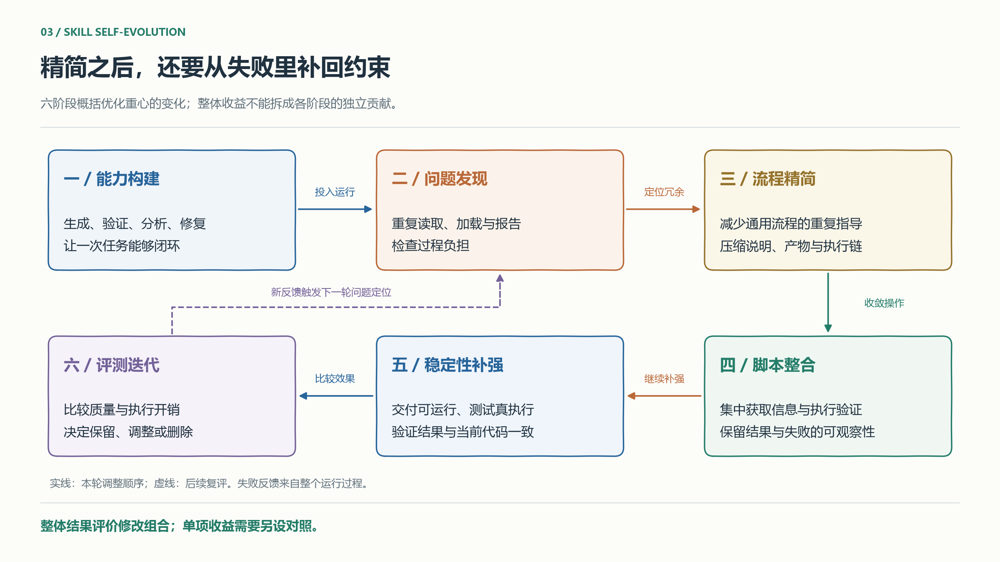
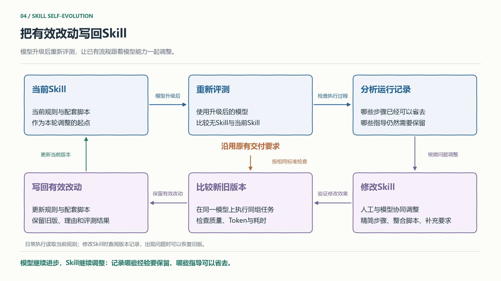

一套Skill往往记录着模型曾经做不好的事：容易漏掉需求，就加检查清单；多轮修改容易丢失结论，就写中间报告；不会稳定地验证结果，就规定分析与运行的顺序。这些规则把工程经验变成可复用的工作方法，也把当时的能力局限固化进了流程。

模型能力变化以后，规则的收益和成本可能朝两个方向走。如果模型已经能主动完成相应分析，重复提醒的收益就会降低；规则要求的报告、读取和工具往返却仍然发生。**Skill需要持续回答：在当前模型、任务和环境下，多加这一步，究竟改善了什么结果？**

这意味着，维护Skill要同时设计规则的加入条件和退出条件。随着后训练等能力改进，部分通用方法可能逐渐由模型承担；项目当前的事实、组织的交付要求和本次运行的结果，仍需要外部提供或实际获取。职责如何移动，应由运行证据决定。

这次单元测试实验给出了一个具体切口：调整流程后，记录中的累计Token下降67.9%，平均任务耗时下降40.2%，整体质量评分从93.68变为94.03。这个结果让Skill的维护有了更具体的方向：重新检查旧流程，把投入集中到仍能改善任务结果的支持上。

*图1：按规则的收益、成本与适用条件，调整模型和Skill各自承担的工作。*

## 实验背景与研究问题

实验围绕单元测试展开。生成、有效性分析和迭代优化三个Skill协同工作，并通过编译运行检查结果。旧版首先解决了任务能否完成的问题。实际使用中，又暴露出重复读取源码、中间报告反复维护、部分验证轮次没有带来有效变化等过程负担。

新版删减了部分通用流程说明和中间报告，把源码与环境信息获取、编译运行等固定操作整合为脚本，再根据运行失败补充交付约束。这些修改由人工与模型协同完成，通过运行记录和新旧版本比较决定是否保留。这里的自进化，指反馈进入了工作指南的更新过程，自动提出候选、独立筛选和自动发布尚未组成完整系统。

三组分别使用无Skill、完整Skill（旧版）和优化Skill（新版），各覆盖7个项目、140个对应任务。实验在九问iCode上运行，记录中的模型标识均为GLM-5.2；质量采用既有CodeBench报告评分，开销统计会话Token与任务耗时。无Skill组仍在平台提供的模型、工具和运行环境中完成任务，反映的是这套基础执行环境的表现。

Token包含各轮输入与输出的累计量，其中存在缓存命中；它衡量会话处理规模，不能直接换算成等比例的账单变化。

- **RQ1：完整Skill相比无Skill，带来了多少增量价值？**
- **RQ2：精简流程、整合脚本并补强约束后，质量与成本发生了什么变化？**
- **RQ3：如何让运行反馈持续改善Skill，同时保住验收标准？**

## RQ1：完整Skill相比无Skill，带来了多少增量价值？

> **RA1：**完整Skill的整体报告评分比无Skill高4.84分，平均Token约为基线的6.2倍，耗时约为2.9倍。不同任务组的收益并不一致。这支持按场景复评流程，但还不能判断每条规则的独立贡献。

### 先看整体，再看平均数掩盖了什么

| 条件 | 整体质量评分（报告值） | 平均每任务Token | 平均任务耗时 |
| --- | ---: | ---: | ---: |
| 无Skill | 88.84 | 62.3万 | 12.5分钟 |
| 完整Skill（旧版） | 93.68 | 387.6万 | 35.7分钟 |

完整Skill平均每任务增加约325.3万Token和23.2分钟。是否值得，要看额外质量对任务有多重要。仅凭这张表，既不能认定完整流程都必要，也不能因为成本高就把它全部删除。

分组结果说明了这种判断为什么需要更细：

| 任务组 | 无Skill评分（报告值） | 旧版Skill评分（报告值） | 无Skill平均Token | 旧版Skill平均Token |
| --- | ---: | ---: | ---: | ---: |
| Apollo | 96.94 | 96.70 | 74.7万 | 380.7万 |
| MyBatis-3 | 89.73 | 95.29 | 61.1万 | 354.0万 |

Apollo组中，无Skill已经取得较高评分，完整流程把Token提高到约5.1倍，没有观察到评分增加。MyBatis-3组中，旧版则高5.56分。同一套流程在不同任务组里带来了不同的收益，Skill可以据此调整支持的范围与深度，把额外投入用在更需要帮助的任务上。

更有用的判断是：**流程价值属于模型、任务和环境的组合。**一条帮助模型理解项目约定的规则，在熟悉的代码结构里可能收益很小，在依赖关系陌生的项目里却可能避免反复试错。模型升级、任务分布变化，甚至工具入口改善，都可能改变这条规则的必要性。

### 每条规则都在用执行成本购买某种收益

规则带来的收益，可能是提高产物质量，也可能是减少失败、返工或人工复核。它的成本包括额外推理、工具往返，以及维护规则与脚本的投入。判断某一步是否值得保留，需要把它减少的损失与增加的成本放在同一任务语境下比较。

例如，一份报告如果只是重述当前上下文里的结论，价值可能很低。如果下一阶段在独立会话中执行，它就可能承担必要的信息交接。重复读取同一文件也未必多余：文件改过、上下文丢失或验证范围变化，都可能使重新读取合理。**优化对象应是没有增加有效信息或结果保障的工作。**相似的操作记录，只能帮助定位候选，不能直接充当删除依据。

这也解释了为什么一次失败之后立刻加一条全局规则，容易让Skill膨胀。那次失败可能来自暂时的环境故障，也可能只发生在特定任务里。把局部补丁永久放进默认路径，后续每个任务都会付费。修复规则应写清适用条件；必要时修工具、修环境，或在异常出现时再进入额外流程。

无Skill对照帮助估计整套支持的增量价值。要判断具体步骤，还需要删掉或替换该步骤后的对照。由此可以提出下一轮方案：在共同的交付标准下，根据可观测的任务特征和失败信号增加分析深度。这是后续待验证的设计方向，本次实验尚未验证自动分流策略。

## RQ2：精简流程、整合脚本并补强约束后，质量与成本发生了什么变化？

> **RA2：**新版相对旧版的累计会话Token下降67.9%，平均耗时下降40.2%，整体评分从93.68变为94.03。新版以更低的执行开销取得了接近的整体评分，开销改善覆盖了多数任务。

### 开销下降，整体评分相近

| 指标 | 完整Skill（旧版） | 优化Skill（新版） | 变化 |
| --- | ---: | ---: | ---: |
| 整体质量评分（报告值） | 93.68 | 94.03 | +0.35分 |
| 累计会话Token | 5.426亿 | 1.744亿 | −67.9% |
| 平均任务耗时 | 35.7分钟 | 21.3分钟 | −40.2% |

新版平均每任务约124.5万Token，仍为无Skill组的2倍。与旧版相比，为额外支持付出的代价已经明显降低。优化的价值体现在这里：保留有用的指导与执行能力，同时减少围绕它们发生的重复工作。

*图2：三组各140个对应任务。评分为既有报告值；Token为记录中的会话累计输入与输出；耗时为单任务执行时长的平均值。*

逐任务配对后，新版在135个任务上Token更少，在126个任务上耗时更短，说明开销改善覆盖了多数任务。另有5个任务Token增加、14个任务耗时增加。例如，一个MyBatis-3任务的Token接近旧版的两倍，这些任务可以成为下一轮复盘的具体入口。

汇总结果帮助判断整体投入，具体任务帮助定位下一轮修改。沿着开销增加的任务继续检查，可以找出额外工作发生在哪个环节、由什么条件触发，再决定调整默认流程，还是为这类任务保留专门的处理路径。

### 流程成本会沿着会话累积

这轮调整经历了能力构建、问题发现、流程精简、脚本整合、稳定性补强和评测迭代六个阶段。它们描述实际工作的先后顺序，各阶段没有独立对照，无法把总收益分摊给某一项改动。

*图3：实线表示本轮调整顺序，虚线表示新反馈触发后续复评；各阶段没有单独测量收益。*

| 过程指标（既有过程报告汇总） | 旧版 | 新版 |
| --- | ---: | ---: |
| 顶层工具调用次数 | 9,736 | 5,326 |
| 中间产物写入或修改次数 | 2,416 | 60 |
| Skill入口加载次数 | 362 | 419 |
| 每次入口加载的平均返回字符 | 22.7K | 4.9K |

入口加载次数增加，返回内容却大幅缩短。这个结果提醒我们，调用次数只是过程线索：一次长返回可能增加很多后续输入，几次短调用则可能更便宜。字符数也不能直接当作Token相加。

一份报告的成本会经历生成、写入、再次读取以及继续留在历史上下文中的过程。如果它被后续多轮请求携带，就会被重复计入累计输入。减少这种信息往返，可能比把某段文字压缩几行更有价值。

原始记录中，旧版到新版减少的Token约98.3%来自输入侧。这个构成与减少上下文负担的解释相容，但输入还包含源码、工具结果等内容，不能把98.3%归因于删除报告。这组数据能说明成本主要在哪里下降，尚不能单独解释是哪条修改造成了下降。

### 脚本化把重复决策变成可复用的执行能力

新版用配套脚本集中获取源码与构建信息，统一执行编译和测试。固定操作交给脚本后，模型不必在每次任务中重新寻找入口、拼接命令和解释同类输出，可以把更多判断留给测试内容与失败原因。

这里发生的是计算与维护责任的转移：原来每次会话都要重新组织的工作，变成一次实现、多次调用的工具能力。收益取决于操作是否足够稳定、是否会重复使用。面对变化频繁的项目环境，脚本适配和异常处理也会消耗维护成本；这些人力与执行资源没有包含在本次Token降幅里。

好的脚本接口还要保留必要的可观察性。模型需要知道目标测试是否实际执行、验证覆盖了什么、失败发生在哪一层。把一串操作包装成一个入口，如果只返回模糊的成功标志，就会压缩掉诊断所需的信息。因此，脚本化应减少重复组织工作，同时让结果和失败更容易检查。

### 分析步骤可以调整，交付证据必须对应当前结果

流程精简后，部分任务暴露出编译未通过或平台运行异常。新版据此补充要求：代码需要能够运行，目标测试需要实际执行，验证结果需要与当前代码一致。

这些要求与固定轮次的分析说明有不同性质。分析步骤规定模型怎样做事；验收要求规定什么结果可以交付。前者可以由模型能力和任务状态决定，后者需要由任务目标决定。模型会分析代码，不能因此知道尚未运行的测试结果；同样，一次编译通过只支持可编译性，不能独自证明测试覆盖充分、断言有效。

验证证据还有适用范围。它对应某份代码、输入、环境与测试目标。相关条件变化后，旧的通过记录就需要重新确认。由此看，精简流程的方向可以是减少固定动作、增加条件判断，但交付所需的证据必须完整。

## RQ3：如何让运行反馈持续改善Skill，同时保住验收标准？

> **RA3：**建立任务执行与方法更新两套相互连接的流程：前者交付结果并留下可检查的证据，后者据此提出修改，在独立维护的验收标准下比较候选，再决定采用或回退。这是一种迁移建议，跨Skill效果仍需重新验证。

### 让模型修改方法，让评测决定修改是否成立

模型可以同时阅读Skill、任务要求、运行轨迹和失败结果，提出哪些规则应删减、哪些操作适合脚本化、哪些约束存在缺口。这种参与方式把模型的分析能力用到了工作方法本身。

但执行方法与成功标准需要分开维护。如果候选Skill可以同时删掉测试要求、缩小测试范围，再用新的标准证明自己更快，就无法判断改进来自能力增强还是要求降低。人工应预先确定验收条件，候选版本在相同标准下接受检查；标准因业务变化需要修改时，应作为单独变更说明理由，并重新建立对照。

自进化的边界因而落在修改权和验收权的分配上。模型可以扩大对方法的探索空间，评测必须独立判断产物是否达标。对于单元测试，编译与执行结果、外部质量评估分别检查不同问题；对于开放式文档，事实核查和人工抽检仍可能不可替代。评测能识别什么，决定了这套更新机制能够可靠地优化什么。

### 每次修改都留下可被推翻的预期

一次可检查的修改，至少要说明触发它的现象、预期改变和适用条件。例如，删除一份中间报告，预期是减少后续输入，同时保留跨阶段所需的信息。如果下一阶段因此漏掉关键约束，这项修改就需要撤回或重新设计。

能隔离时，尽量比较单项修改；存在强依赖时，可以把相关改动作为一个候选包，但只评价组合效果。这次精简、脚本整合和约束补强同时发生，就属于后者。用执行轨迹解释机制，再用产物结果判断收益，能减少把相关性写成因果的风险。

评测任务也应区分用途。用于定位问题的任务，会影响候选怎么写；修改过程中没有用过的任务，才能帮助检查是否只是适配了已知样例。先确定关键验收项、可接受的退化范围和成本目标，再进行配对比较；必要时重复运行以观察波动。高风险任务可单独设门槛，避免被整体平均分抵消。

### 经验需要保留有效条件

Skill更新后，日常执行需要当前规则与任务材料；方法维护需要修改理由、失败样例和评测记录。把两类信息按用途组织，可以保留经验，又减少每次任务反复读取历史的负担。

信息复用还要检查有效条件。源码未变，不代表依赖版本和测试配置也未变。验证结果只有在相关输入、产物、环境和检查范围仍匹配时，才可能继续使用。一次失败形成的规则，同样需要记录它针对的条件，以及什么证据出现后可以放宽或删除。

*图4：可供其他Skill参考的执行与更新机制。规则通过比较后才进入日常执行；验收标准单独维护；相关条件变化后重新获取验证证据。*

这让经验从一条永久指令，变成一个有适用范围、依据和复评条件的决策。模型升级时，可以有针对性地重测那些为旧能力缺口增加的步骤；项目环境变化时，优先检查工具与事实获取；任务目标变化时，则需要重新确定验收标准。

模型越善于提出修改，候选数量可能越多，独立验证的投入也会随之增加。因此，自动化的程度应随评测能力提高：先让模型辅助复盘和提出候选，再逐步自动比较、筛选和更新。缺少可靠验收时，人工审核仍是方法更新的一部分。

## 结语：给工程经验设计退出条件

这次实验比较明确的结果是：旧版流程存在可压缩的执行开销，新版用更少的Token和时间取得了接近的整体报告评分。它没有证明Skill会被模型淘汰，也没有证明某个更短的版本适用于所有任务。

更值得延伸的判断是，**Skill的维护单位可以从一份静态指南，细化到每条规则的收益、成本和有效条件。**通用分析的指导可以随着能力变化而复评，稳定操作可以沉淀为工具，当前事实和交付证据需要持续获取。模型与外部支持的职责边界，应跟着这些条件移动。

下一次给Skill加规则时，除了写清模型该做什么，还应记录它解决了哪类失败、依据是什么，以及在什么情况下可以退出。自进化有赖于这些可检查的记录：有效经验得以复用，过期经验有机会被修正，新增方法持续接受同一套交付要求的检验。
